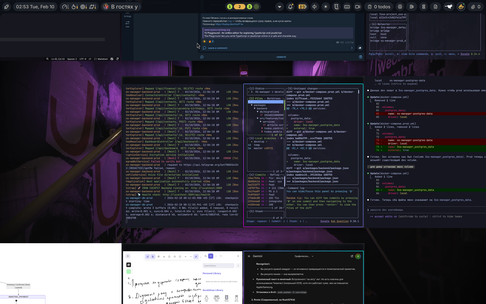
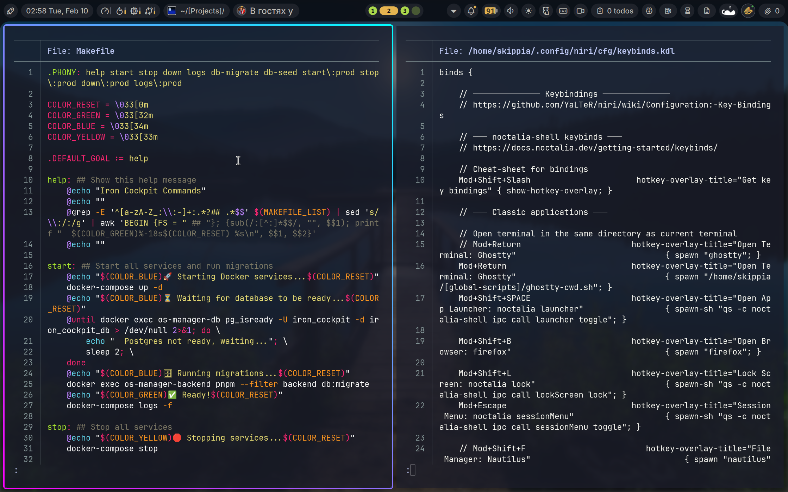
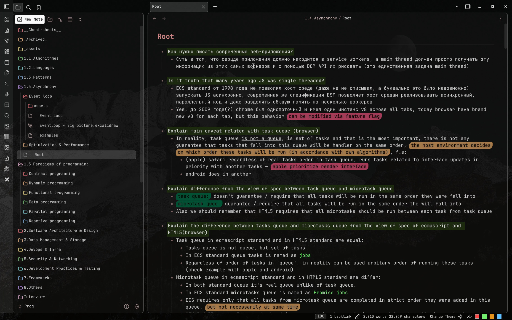
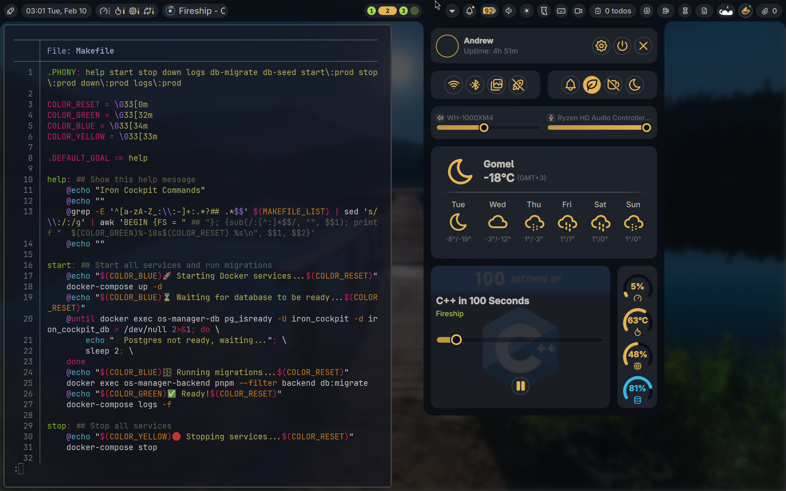
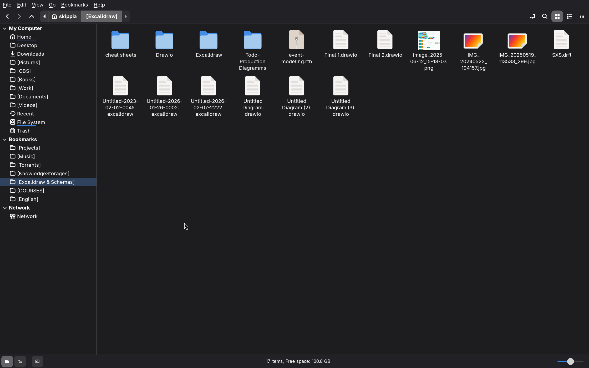
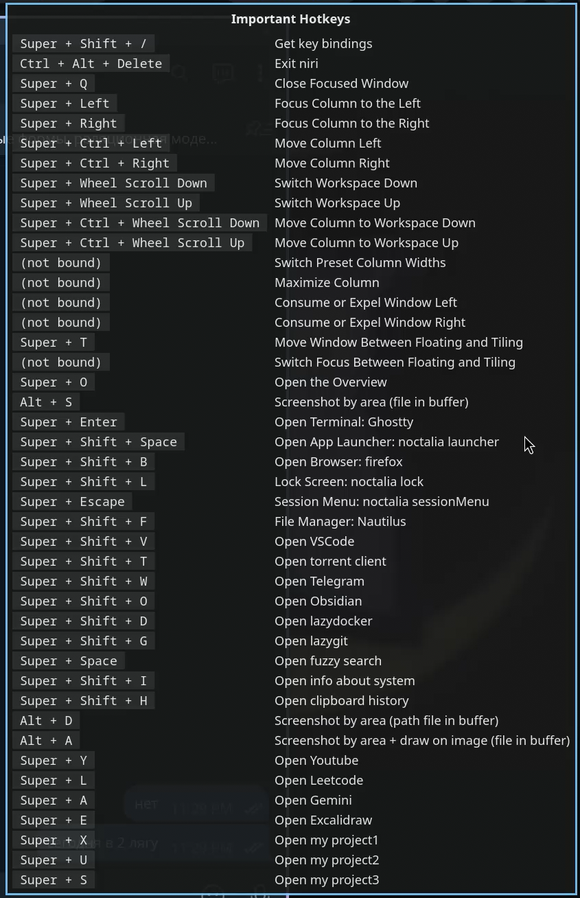

# Configs

Репозиторий с моими конфигурациями и скриптами для **Arch Linux (CachyOS)** с окружением **Niri WM + Fish Shell + Ghostty**

Содержит dot-файлы, настройки приложений, кастомные скрипты и документацию по моему рабочему окружению.

## Структура

| Путь | Описание |
|------|----------|
| `.config/` | Конфигурации приложений (Niri, Fish, Ghostty, Obsidian и др.) |
| `global-scripts/` | Мои Bash-скрипты |
| `.obsidian/` | Настройки и плагины Obsidian |

## Скриншоты

## Документация

- [applications-list.md](applications-list.md) — Список используемых приложений и утилит
- [custom-shell-scripts.md](custom-shell-scripts.md) — Описание кастомных скриптов и алиасов Fish Shell
- [obsidian-plugins.md](obsidian-plugins.md) — Обзор установленных плагинов Obsidian
